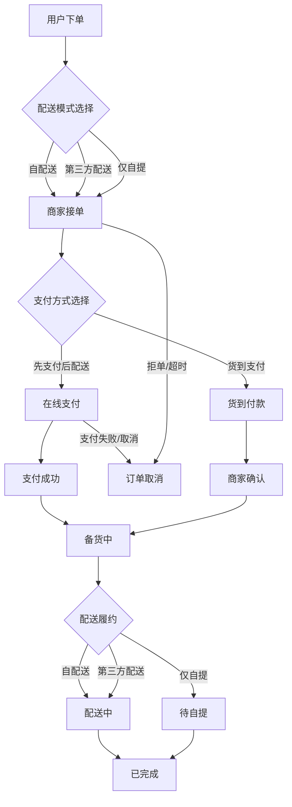

# 订单业务流程与状态流转

## 业务假设与范围
- 支付方式：支持“先支付后配送”（在线支付）与“货到支付”（货到付款）。
- 积分使用：可抵扣订单金额，且允许与现金/在线支付混合使用；积分抵扣不得超过应付金额的可抵扣上限（如不含运费/包装费等，可由运营配置）。
- 配送模式：
  - 自配送
  - 第三方配送（达达、美团配送等）
  - 仅自提

## 业务流程图（Mermaid）

## 订单状态流转表

| 状态 | 含义 | 进入条件 | 允许动作/下一状态 | 备注 |
| --- | --- | --- | --- | --- |
| 待支付 | 订单已创建，等待用户支付 | 在线支付订单创建 | 支付成功 -> 待接单；用户取消 -> 已取消；支付超时 -> 已取消 | 仅“先支付后配送”场景出现 |
| 待接单 | 商家等待确认/接单 | 在线支付成功或货到付款下单 | 商家接单 -> 备货中；商家拒单/超时 -> 已取消 | 货到付款订单直接进入此状态 |
| 备货中 | 商家备货/出库 | 商家接单 | 发货/交给配送 -> 配送中；通知自提 -> 待自提；商家取消 -> 已取消 | 备货完成后进入履约 |
| 配送中 | 骑手/商家配送中 | 自配送或第三方配送发货 | 确认收货/签收 -> 已完成；配送取消 -> 已取消 | 可同步配送轨迹 |
| 待自提 | 用户等待到店自提 | 仅自提或备货完成通知自提 | 用户自提 -> 已完成；自提超时/取消 -> 已取消 | 可配置自提时限 |
| 已完成 | 订单履约完成 | 确认收货或自提完成 | 仅允许售后（不改变主状态） | 终态 |
| 已取消 | 订单被取消 | 用户取消/支付失败/商家拒单/履约取消 | 终态 | 终态 |

## 积分使用规则（摘要）
- 积分可抵扣订单金额，支持与现金/在线支付混合使用。
- 积分抵扣上限由运营配置（如不包含运费、包装费或满减等限制）。
- 货到付款订单仍可使用积分抵扣，线下仅支付剩余金额。

## 对接要点（前后端）
- 订单创建时需传入：配送模式、支付方式、积分使用信息。
- 状态流转由后端驱动，前端根据状态展示相应操作入口。
- 第三方配送需记录配送商标识与运单信息，支持状态同步。
